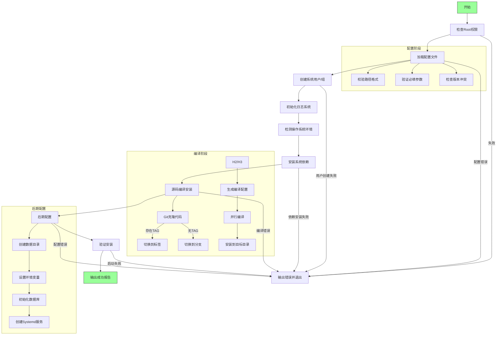

# IvorySQL-AutoInstall使用文档

  

## 1.项目介绍

结合[IvorySQL官方文档](https://docs.ivorysql.org/cn/ivorysql-doc/v4.4/v4.4/6)实现用户在经过简单配置并执行脚本后,可以通过执行一条命令即可安装启动IvorySQL.

  

### 1.1支持的操作系统

**支持的 Linux 发行版**：

- RHEL/CentOS/Rocky/AlmaLinux (8/9)

- Ubuntu/Debian (18.04-24.04)

- openSUSE/SLES (15+)
>**注意：**CentOS7推荐使用官方yum源安装，本项目不支持

  

## 2. 项目产出

- 脚本开始进行环境监测，检查操作系统类型和版本，以及其他必要条件

- 环境监测通过后，脚本开始从指定位置获取 IvorySQL 的源代码

- 获取源码后，脚本自动进行源码编译

- 编译完成后，脚本自动将生成的二进制文件安装到指定的安装目录

- 脚本执行数据库初始化操作

- 脚本启动 IvorySQL 数据库服务，并输出安装成功的提示信息

- 如果安装过程中出现错误，脚本应该输出错误信息并终止安装过程

  

## 3.项目细节

有关该项目的 **架构**

### 3.1项目架构

  



### 3.2配置文件参数

- **配置文件路径**:`/etc/ivorysql/install.conf`

- **关键配置项**:

```ini

INSTALL_DIR = /usr/local/ivorysql/ivorysql-4        # 安装目录（必需）

DATA_DIR = /var/lib/ivorysql/data                   # 数据目录（必需）

SERVICE_USER = ivorysql                             # 服务运行用户（必需）

SERVICE_GROUP = ivorysql                            # 服务运行组（必需）

REPO_URL = https://github.com/IvorySQL/IvorySQL.git # 源码仓库（必需）

LOG_DIR = /var/log/ivorysql                         # 日志目录（默认值）

TAG = IvorySQL_4.5.3                                # 优先使用的版本标签（与分支二选一）

#BRANCH = IVORYSQL_REL_4_STABLE                     # 源码分支

```
> **注意：** 
> 1.不含引号.
> 2.必须是绝对路径.
> 3.必须设置TAG和BRANCH中的一个,同时设置以TAG优先.
> 4.用户/组配置时不可用保留名称.


### 3.3依赖安装介绍
**自动安装的依赖**：

- 编译工具链：GCC, Make, Flex, Bison

- 核心库：readline, zlib, openssl

- 可选库支持：

- ICU (检测路径：`/usr/include/icu.h`)

- libxml2 (检测路径：`/usr/include/libxml2/libxml/parser.h`)

- TCL (检测路径：`/usr/include/tcl.h`)
  

### 3.4源码编译配置
**编译流程和配置**：

1. 版本控制优先顺序：`TAG` > `BRANCH`

2. 强制启用 OpenSSL：`--with-openssl`

3. 智能依赖检测：

```bash

--without-icu # 当检测不到 /usr/include/icu.h 时禁用

--without-libxml # 当检测不到 /usr/include/libxml2/libxml/parser.h 时禁用

--without-tcl # 当检测不到 /usr/include/tcl.h 时禁用
  ```

### 3.5服务文件配置
**生成的 systemd 服务文件**：

- 路径：`/etc/systemd/system/ivorysql.service`

- 关键配置：

```ini

[Service]

Type=forking

User=${SERVICE_USER}

Group=${SERVICE_GROUP}

Environment=PGDATA=${DATA_DIR}

ExecStart=${INSTALL_DIR}/bin/pg_ctl start -D ${PGDATA} -s -w -t 60

ExecStop=${INSTALL_DIR}/bin/pg_ctl stop -D ${PGDATA} -s -m fast

ExecReload=${INSTALL_DIR}/bin/pg_ctl reload -D ${PGDATA}

TimeoutSec=0 # 永不超时

Restart=on-failure # 故障时自动重启

RestartSec=5s # 重启间隔

OOMScoreAdjust=-1000 # 防止OOM Killer终止数据库进程

```

  

**环境变量配置**：

- 添加至用户 `~/.bash_profile`：

```bash

PATH="${INSTALL_DIR}/bin:$PATH"

export PATH

PGDATA="${DATA_DIR}"

export PGDATA
```
### 3.6日志系统

**日志文件结构**：

```

${LOG_DIR}/

├── install_20250101_120000.log # 安装过程日志

├── error_20250101_120000.log # 错误日志

└── postgresql.log # 数据库运行日志（服务启动后生成）

```

  

**权限管理**：

```bash

chown -R "${SERVICE_USER}:${SERVICE_GROUP}" "${LOG_DIR}"

```
  

## 4.使用步骤
### 4.1准备步骤

1. 创建配置文件：

```bash

sudo mkdir -p /etc/ivorysql

sudo nano /etc/ivorysql/install.conf

```

2. 按照规范填写配置文件

3. 保存后脚本会自动设置安全权限：

```bash

chmod 600 /etc/ivorysql/install.conf

```

  

### 4.2执行安装

```bash

chmod +x AutoInstall.sh

sudo ./AutoInstall.sh

```

  

### 4.3安装验证

成功后的关键输出：

```text

================ 安装成功 ================

安装目录: /opt/ivorysql

数据目录: /data/ivorysql

日志目录: /var/log/ivorysql

服务状态: active

数据库版本: ivorysql (IvorySQL) 2.1.0

...

  

安装耗时: 215 秒

```

  

### 4.4管理命令

| 功能 | 命令 |

|------|------|

| 启动服务 | `systemctl start ivorysql` |

| 停止服务 | `systemctl stop ivorysql` |

| 查看状态 | `systemctl status ivorysql` |

| 查看日志 | `journalctl -u ivorysql -f` |

| 服务重载 | `systemctl reload ivorysql` |

| 数据库连接 | `sudo -u ivoryuser /opt/ivorysql/bin/psql` |
