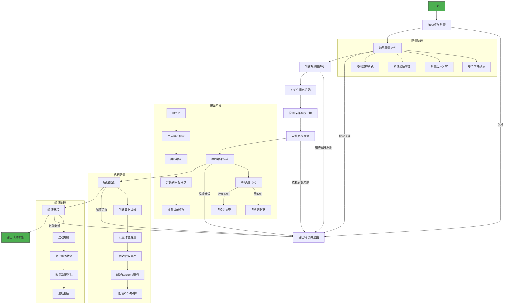

# IvorySQL-AutoInstall 自动化安装工具

## 1. 项目介绍

IvorySQL-AutoInstall 是一个自动化安装脚本，旨在简化 IvorySQL 数据库的编译安装过程。通过简单的配置文件设置，用户可以一键完成从源码编译到服务启动的全过程，无需手动执行复杂的编译命令和配置步骤。

### 1.1 核心功能
- 脚本开始进行环境监测，检查操作系统类型和版本，以及其他必要条件

- 环境监测通过后，脚本开始从指定位置获取 IvorySQL 的源代码

- 获取源码后，脚本自动进行源码编译

- 编译完成后，脚本自动将生成的二进制文件安装到指定的安装目录

- 脚本执行数据库初始化操作

- 脚本启动 IvorySQL 数据库服务，并输出安装成功的提示信息

- 如果安装过程中出现错误，脚本应该输出错误信息并终止安装过程


### 1.2 支持的操作系统
| 操作系统系列 | 具体发行版 | 支持版本 |
|-------------|-----------|---------|
| **RHEL 系列** | CentOS, RHEL, Rocky Linux, AlmaLinux | 8.x, 9.x |
| **Debian 系列** | Ubuntu, Debian | Ubuntu 18.04-24.04<br>Debian 10-12 |
| **SUSE 系列** | openSUSE, SLES | openSUSE Leap 15+<br>SLES 12.5+ |
| **Arch Linux** | Arch Linux | 最新稳定版 |

> **注意**：CentOS 7 推荐使用官方 YUM 源安装，本项目不支持 CentOS 7

## 2. 项目架构设计



## 3. 项目细节

### 3.1 配置文件详解

**配置文件路径**：`/etc/ivorysql/install.conf`

| 配置项 | 是否必需 | 默认值 | 说明 |
|--------|----------|--------|------|
| `INSTALL_DIR` | 是 | 无 | IvorySQL 安装目录（必须是绝对路径） |
| `DATA_DIR` | 是 | 无 | 数据库数据目录（必须是绝对路径） |
| `SERVICE_USER` | 是 | 无 | 服务运行用户（不能使用系统保留名称） |
| `SERVICE_GROUP` | 是 | 无 | 服务运行组（不能使用系统保留名称） |
| `REPO_URL` | 是 | 无 | IvorySQL 源码仓库 URL |
| `LOG_DIR` | 是 | `/var/log/ivorysql` | 日志目录（必须是绝对路径） |
| `TAG` | 可选 | 无 | 指定安装的版本标签（优先使用） |
| `BRANCH` | 可选 | 无 | 指定安装的源码分支 |

> **配置注意事项**：
> 1. 所有路径配置必须是绝对路径，不能包含空格
> 2. 必须设置 `TAG` 或 `BRANCH` 中的一个，同时设置时优先使用 `TAG`
> 3. 用户/组名称不能使用系统保留名称（root, bin, daemon 等）
> 4. 配置文件权限自动设置为 600（仅 root 可读写）

**配置示例**：
```ini
# IvorySQL 自动化安装配置
INSTALL_DIR=/opt/ivorysql/ivorysql-4.5
DATA_DIR=/var/lib/ivorysql/data
SERVICE_USER=ivorysql
SERVICE_GROUP=ivorysql
REPO_URL=https://github.com/IvorySQL/IvorySQL.git
LOG_DIR=/var/log/ivorysql
TAG=IvorySQL_4.5.3
```

### 3.2 依赖管理系统

脚本会自动检测操作系统类型并安装所需依赖：

#### 核心依赖
- **编译工具链**：GCC, Make, Flex, Bison
- **核心库**：readline, zlib, openssl

#### 可选依赖支持
| 依赖库 | 检测路径 | 自动处理 |
|--------|----------|----------|
| ICU | `/usr/include/icu.h` | 检测不到时添加 `--without-icu` |
| libxml2 | `/usr/include/libxml2/libxml/parser.h` | 检测不到时添加 `--without-libxml` |
| TCL | `/usr/include/tcl.h` | 检测不到时添加 `--without-tcl` |

#### 操作系统特定依赖
| 操作系统 | 额外依赖包 |
|----------|------------|
| **RHEL 系列** | `epel-release`, `Development Tools` 组 |
| **Debian 系列** | `build-essential`, `libreadline-dev`, `libssl-dev`, `zlib1g-dev` |
| **SUSE 系列** | `bison-devel`, `readline-devel`, `zlib-devel`, `libopenssl-devel` |

### 3.3 编译流程详解

1. **版本控制**：
   - 优先使用 `TAG` 指定的版本
   - 未指定 `TAG` 时使用 `BRANCH` 指定的分支
   - 记录安装的 Commit ID（短哈希值）

2. **编译配置**：
   ```bash
   ./configure --prefix=$INSTALL_DIR \
               --with-openssl \
               --without-icu \        # 当检测不到 ICU 时
               --without-libxml \     # 当检测不到 libxml2 时
               --without-tcl           # 当检测不到 TCL 时
   ```

3. **并行编译**：
   - 使用所有可用 CPU 核心：`make -j$(nproc)`
   - 优化大型项目的编译速度

4. **安装后处理**：
   - 设置安装目录权限：`chown -R $SERVICE_USER:$SERVICE_GROUP $INSTALL_DIR`
   - 验证二进制文件完整性

### 3.4 服务管理系统

#### Systemd 服务文件
**路径**：`/etc/systemd/system/ivorysql.service`

**关键配置**：
```ini
[Service]
Type=forking
User=ivorysql
Group=ivorysql
Environment=PGDATA=/var/lib/ivorysql/data
ExecStart=/opt/ivorysql/bin/pg_ctl start -D ${PGDATA} -s -w -t 60
ExecStop=/opt/ivorysql/bin/pg_ctl stop -D ${PGDATA} -s -m fast
ExecReload=/opt/ivorysql/bin/pg_ctl reload -D ${PGDATA}
TimeoutSec=0
Restart=on-failure
RestartSec=5s
OOMScoreAdjust=-1000
```

**配置说明**：
- **OOMScoreAdjust=-1000**：显著降低 OOM Killer 终止数据库进程的可能性
- **TimeoutSec=0**：禁用超时限制，避免长时间操作被中断
- **Restart=on-failure**：服务异常退出时自动重启
- **Type=forking**：正确管理后台进程的生命周期

#### 环境变量配置
**路径**：`/home/ivorysql/.bash_profile`

```bash
# --- IvorySQL Environment Configuration ---
PATH="/opt/ivorysql/bin:$PATH"
export PATH
PGDATA="/var/lib/ivorysql/data"
export PGDATA
# --- End of Configuration ---
```

**效果**：
1. 可直接在命令行执行 `psql` 等命令
2. 数据库工具自动识别数据目录位置
3. 服务账户登录时自动配置环境

### 3.5 日志系统

#### 日志文件结构
```
/var/log/ivorysql/
├── install_20250101_120000.log  # 安装过程日志
├── error_20250101_120000.log    # 安装错误日志
└── postgresql.log               # 数据库运行日志（服务启动后生成）
```

#### 日志管理特性
- **自动轮转**：通过 PostgreSQL 内置日志管理实现
- **权限控制**：`chown -R ivorysql:ivorysql /var/log/ivorysql`
- **日志级别**：可在数据库配置中调整
- **安装日志**：包含完整的时间戳和步骤标记

#### 日志格式示例
```
[14:25:33] 配置加载阶段
  → 检查配置文件是否存在...
  ✓ 发现配置文件
  → 加载配置文件...
  ✓ 配置文件加载成功
```

## 4. 使用指南

### 4.1 准备工作
1. 使用root权限：
   ```bash
   su -
   ```

2. 创建配置文件目录：
   ```bash
   sudo mkdir -p /etc/ivorysql
   ```

3. 创建配置文件：
   ```bash
   sudo nano /etc/ivorysql/install.conf
   ```

4. 填写配置内容（参考以下示例）：
   ```ini
   # IvorySQL 安装配置
   INSTALL_DIR=/opt/ivorysql
   DATA_DIR=/var/lib/ivorysql/data
   SERVICE_USER=ivorysql
   SERVICE_GROUP=ivorysql
   REPO_URL=https://github.com/IvorySQL/IvorySQL.git
   LOG_DIR=/var/log/ivorysql
   TAG=IvorySQL_4.5.3
   ```

### 4.2 执行安装

1. 下载安装脚本：
   ```bash
   wget https://raw.githubusercontent.com/yangchunwanwusheng/IvorySQL-AutoInstaller/main/AutoInstall.sh
   ```

2. 添加执行权限：
   ```bash
   chmod +x AutoInstall.sh
   ```

3. 运行安装脚本：
   ```bash
   sudo ./AutoInstall.sh
   ```

### 4.3 安装过程监控

安装过程中，脚本会实时输出进度信息：
- **蓝色文本**：当前阶段标题
- **普通文本**：步骤开始提示
- **绿色文本**：步骤成功完成
- **红色文本**：严重错误（安装终止）
- **黄色文本**：警告信息（需要确认或注意）

### 4.4 安装验证

成功安装后，将显示以下信息：
```text
================ 安装成功 ================
安装目录: /opt/ivorysql
数据目录: /var/lib/ivorysql/data
日志目录: /var/log/ivorysql
服务状态: active
数据库版本: ivorysql (IvorySQL) 4.5.3

管理命令: 
  systemctl [start|stop|status] ivorysql
  journalctl -u ivorysql -f
  sudo -u ivorysql '/opt/ivorysql/bin/psql'

安装时间: 2025年 03月 15日 星期六 14:30:45 CST
安装耗时: 215 秒
```

### 4.5 服务管理命令

| 功能 | 命令 | 说明 |
|------|------|------|
| **启动服务** | `systemctl start ivorysql` | 启动数据库服务 |
| **停止服务** | `systemctl stop ivorysql` | 停止数据库服务 |
| **服务状态** | `systemctl status ivorysql` | 查看服务运行状态 |
| **服务日志** | `journalctl -u ivorysql -f` | 实时查看服务日志 |
| **重载配置** | `systemctl reload ivorysql` | 重载服务配置 |
| **数据库连接** | `sudo -u ivorysql /opt/ivorysql/bin/psql` | 连接到数据库 |
| **查询版本** | `/opt/ivorysql/bin/postgres --version` | 查看数据库版本 |
| **初始化备份** | `sudo -u ivorysql /opt/ivorysql/bin/pg_basebackup` | 创建基础备份 |

## 5. 故障排查

### 5.1 常见错误处理

| 错误现象 | 可能原因 | 解决方案 |
|----------|----------|----------|
| 配置文件不存在 | 未创建配置文件或路径错误 | 检查 `/etc/ivorysql/install.conf` 是否存在 |
| 依赖安装失败 | 网络问题或软件源不可用 | 检查网络连接，尝试更换软件源 |
| 编译错误 | 系统环境不满足要求 | 检查系统版本是否符合要求，查看错误日志 |
| 数据库初始化失败 | 数据目录权限问题 | 检查数据目录所有权：`chown ivorysql:ivorysql /var/lib/ivorysql/data` |
| 服务启动失败 | 端口冲突或配置错误 | 检查端口占用：`ss -tulnp \| grep 5432` |

### 5.2 诊断命令

1. 检查服务状态：
   ```bash
   systemctl status ivorysql -l --no-pager
   ```

2. 查看完整日志：
   ```bash
   journalctl -u ivorysql --since "1 hour ago" --no-pager
   ```

3. 手动启动调试：
   ```bash
   sudo -u ivorysql /opt/ivorysql/bin/postgres -D /var/lib/ivorysql/data -c logging_collector=on
   ```

4. 检查配置文件：
   ```bash
   ls -l /etc/ivorysql/install.conf
   cat /etc/ivorysql/install.conf
   ```

### 5.3 日志文件位置

1. **安装日志**：`/var/log/ivorysql/install_<时间戳>.log`
2. **错误日志**：`/var/log/ivorysql/error_<时间戳>.log`
3. **数据库日志**：`/var/log/ivorysql/postgresql.log`

