# IvorySQL-AutoInstall 自动化安装工具使用文档

## 1. 项目介绍

IvorySQL-AutoInstall 是一个专业的自动化安装脚本，旨在简化 IvorySQL 数据库的编译安装过程。通过简单的配置文件设置，用户可以一键完成从源码编译到服务启动的全过程，无需手动执行复杂的编译命令和配置步骤。

### 1.1 核心功能

- **环境检测与验证**：自动检测操作系统类型和版本，验证系统兼容性
- **智能依赖管理**：自动安装编译所需依赖包，支持多平台包管理器
- **源码获取与编译**：从指定仓库获取源代码，并行编译优化构建速度
- **自动化安装配置**：自动设置安装目录、数据目录和日志目录权限
- **服务集成**：自动创建 systemd 服务并配置环境变量
- **全面日志记录**：详细记录安装过程，便于故障排查
- **错误处理与回滚**：完善的错误检测和处理机制

### 1.2 支持的操作系统

| 操作系统系列 | 具体发行版 | 支持版本 |
|-------------|-----------|----------|
| RHEL 系列 | CentOS, RHEL, Rocky Linux, AlmaLinux, Oracle Linux | 8.x, 9.x, 10.x |
| Debian 系列 | Ubuntu, Debian | Ubuntu 18.04-24.04, Debian 10-12 |
| SUSE 系列 | openSUSE, SLES | openSUSE Leap 15+, SLES 12.5+ |
| Arch Linux | Arch Linux | 最新稳定版 |

> **注意**：CentOS 7 推荐使用官方 YUM 源安装，本项目不支持 CentOS 7

## 2. 项目架构设计

```mermaid
graph TD
    A[开始] --> B[Root权限检查]
    B --> C[加载配置文件]
    C --> D[初始化日志系统]
    D --> E[创建系统用户/组]
    E --> F[检测操作系统环境]
    F --> G[安装系统依赖]
    G --> H[源码编译安装]
    H --> I[后期配置]
    I --> J[验证安装]
    J --> K[输出成功报告]

    style A fill:#4CAF50,stroke:#333
    style K fill:#4CAF50,stroke:#333

    B -->|失败| ERR[输出错误并退出]
    C -->|配置错误| ERR
    D -->|日志初始化失败| ERR
    E -->|用户创建失败| ERR
    F -->|环境不支持| ERR
    G -->|依赖安装失败| ERR
    H -->|编译错误| ERR
    I -->|配置错误| ERR
    J -->|启动失败| ERR

    subgraph 配置阶段
        C1[配置文件验证] --> C11[路径格式检查]
        C1 --> C12[保留名称过滤]
        C1 --> C13[危险字符检测]
        C1 --> C14[版本优先级处理]
        C --> C1
    end

    subgraph 环境检测
        F1[操作系统识别] --> F11[RHEL系列]
        F1 --> F12[Debian系列]
        F1 --> F13[SUSE系列]
        F1 --> F14[Arch Linux]
        F1 --> F15[特殊系统处理]
        F --> F1

        F2[包管理器确定] --> F21[dnf/yum]
        F2 --> F22[apt-get]
        F2 --> F23[zypper]
        F2 --> F24[pacman]
        F --> F2
    end

    subgraph 依赖管理
        G1[核心依赖] --> G11[编译工具链]
        G1 --> G12[核心库]
        G1 --> G13[Perl环境]
        G --> G1

        G2[可选依赖] --> G21[ICU检测]
        G2 --> G22[XML支持检测]
        G2 --> G23[TCL检测]
        G2 --> G24[Perl开发环境]
        G --> G2

        G3[特殊系统处理] --> G31[Rocky Linux 10]
        G3 --> G32[Oracle Linux]
        G3 --> G33[Perl模块安装]
        G --> G3
    end

    subgraph 编译阶段
        H1[源码获取] --> H11[Git克隆]
        H1 --> H12[重试机制]
        H --> H1

        H2[版本控制] --> H21[TAG优先]
        H2 --> H22[分支切换]
        H2 --> H23[Commit ID记录]
        H --> H2

        H3[环境验证] --> H31[Perl模块验证]
        H3 --> H32[工具链验证]
        H --> H3

        H4[编译配置] --> H41[基础参数]
        H4 --> H42[功能支持参数]
        H4 --> H43[配置执行]
        H --> H4

        H5[编译过程] --> H51[并行编译]
        H5 --> H52[错误处理]
        H --> H5

        H6[安装过程] --> H61[二进制安装]
        H6 --> H62[权限设置]
        H --> H6
    end

    subgraph 后期配置
        I1[数据目录] --> I11[目录创建]
        I1 --> I12[权限设置]
        I1 --> I13[清除非空目录]
        I --> I1

        I2[环境变量] --> I21[bash_profile配置]
        I2 --> I22[环境变量生效]
        I --> I2

        I3[数据库初始化] --> I31[initdb命令]
        I3 --> I32[功能支持处理]
        I3 --> I33[日志记录]
        I --> I3

        I4[服务配置] --> I41[服务文件创建]
        I4 --> I42[服务参数配置]
        I4 --> I43[服务启用]
        I4 --> I44[OOM保护配置]
        I --> I4
    end

    subgraph 验证阶段
        J1[服务启动] --> J11[systemctl启动]
        J1 --> J12[错误处理]
        J --> J1

        J2[状态监控] --> J21[活动状态检查]
        J2 --> J22[超时处理]
        J --> J2

        J3[功能验证] --> J31[扩展功能验证]
        J3 --> J32[连接测试]
        J --> J3

        J4[报告生成] --> J41[安装摘要]
        J4 --> J42[管理命令]
        J4 --> J43[问题排查指南]
        J --> J4
    end

    %% 新增的优化点
    D -->|提前日志初始化| G[依赖安装]
    G2 -->|实时反馈| H4[编译配置]
    I3 -->|XML支持状态| I32[功能支持处理]
    J -->|服务状态| J2[状态监控]
    K -->|包含| J4[报告生成]

    style ERR fill:#FF5722,stroke:#333
```



## 3. 项目细节

### 3.1 配置文件详解

配置文件路径：`/etc/ivorysql/install.conf`

| 配置项 | 是否必需 | 默认值 | 说明 |
|--------|----------|--------|------|
| INSTALL_DIR | 是 | 无 | IvorySQL 安装目录（必须是绝对路径） |
| DATA_DIR | 是 | 无 | 数据库数据目录（必须是绝对路径） |
| SERVICE_USER | 是 | 无 | 服务运行用户（不能使用系统保留名称） |
| SERVICE_GROUP | 是 | 无 | 服务运行组（不能使用系统保留名称） |
| REPO_URL | 是 | 无 | IvorySQL 源码仓库 URL |
| LOG_DIR | 是 | /var/log/ivorysql | 日志目录（必须是绝对路径） |
| TAG | 可选 | 无 | 指定安装的版本标签（优先使用） |
| BRANCH | 可选 | 无 | 指定安装的源码分支 |

**配置注意事项**：
- 所有路径配置必须是绝对路径，不能包含空格
- 必须设置 TAG 或 BRANCH 中的一个，同时设置时优先使用 TAG
- 用户/组名称不能使用系统保留名称（root, bin, daemon 等）
- 配置文件权限自动设置为 600（仅 root 可读写）

**配置示例**：
```ini
# IvorySQL 自动化安装配置
INSTALL_DIR=/opt/ivorysql
DATA_DIR=/var/lib/ivorysql/data
SERVICE_USER=ivorysql
SERVICE_GROUP=ivorysql
REPO_URL=https://github.com/IvorySQL/IvorySQL.git
LOG_DIR=/var/log/ivorysql
TAG=IvorySQL_4.5.3
```

### 3.2 依赖管理系统

#### 核心依赖（必备组件，自动强制安装）
- 编译工具链: GCC, Make, Flex, Bison
- 核心库: readline, zlib, openssl
- Perl 环境: perl-core, perl-devel, perl-IPC-Run

#### 可选依赖支持（智能检测机制，未找到时自动禁用对应功能）

| 依赖库 | 检测路径 | 自动处理 |
|--------|----------|----------|
| ICU | `/usr/include/icu.h` 或 `/usr/include/unicode/utypes.h` | 检测不到时添加 `--without-icu` 编译参数 |
| libxml2 | `/usr/include/libxml2/libxml/parser.h` | 检测不到时添加 `--without-libxml` |
| TCL | `/usr/include/tcl.h` | 检测不到时添加 `--without-tcl` |
| Perl | `/usr/bin/perl` 和 Perl 头文件 | 检测不到时添加 `--without-perl` |

#### 操作系统特定依赖安装命令

| 操作系统 | 安装命令 |
|----------|----------|
| RHEL 系列 (CentOS/RHEL/Rocky) | `dnf group install "Development Tools"` <br> `dnf install readline-devel zlib-devel openssl-devel` |
| Debian 系列 (Ubuntu/Debian) | `apt-get install build-essential libreadline-dev zlib1g-dev libssl-dev` |
| SUSE 系列 (openSUSE/SLES) | `zypper install gcc make flex bison readline-devel zlib-devel libopenssl-devel` |
| Arch Linux | `pacman -S base-devel readline zlib openssl` |

#### 实现特性
- **操作系统自动识别**：精确检测RHEL/Debian/SUSE等主流发行版
- **核心依赖强制安装**：确保编译工具链和核心库完备
- **智能依赖检测**：
  - 自动扫描标准头文件路径
  - 缺失时动态调整编译参数
  - 实时反馈功能禁用状态
- **完整工具链验证**：
  ```bash
  for cmd in gcc make flex bison; do
    command -v $cmd >/dev/null || echo "警告: $cmd 未安装"
  done
  ```

### 3.3 编译流程详解

#### 版本控制
- 优先使用 TAG 指定的版本
- 未指定 TAG 时使用 BRANCH 指定的分支
- 记录安装的 Commit ID（短哈希值）

#### 编译配置
```bash
./configure --prefix=$INSTALL_DIR \
            --with-openssl \
            --with-readline \
            --without-icu \        # 当检测不到 ICU 时
            --without-libxml \     # 当检测不到 libxml2 时
            --without-tcl \        # 当检测不到 TCL 时
            --without-perl         # 当检测不到 Perl 开发环境时
```

#### 并行编译
- 使用所有可用 CPU 核心：`make -j$(nproc)`
- 优化大型项目的编译速度

#### 安装后处理
- 设置安装目录权限：`chown -R $SERVICE_USER:$SERVICE_GROUP $INSTALL_DIR`
- 验证二进制文件完整性

### 3.4 服务管理系统

#### Systemd 服务文件
路径：`/etc/systemd/system/ivorysql.service`

```ini
[Unit]
Description=IvorySQL Database Server
Documentation=https://www.ivorysql.org
Requires=network.target local-fs.target
After=network.target local-fs.target

[Service]
Type=forking
User=ivorysql
Group=ivorysql
Environment=PGDATA=/var/lib/ivorysql/data
Environment=LD_LIBRARY_PATH=/opt/ivorysql/lib:/opt/ivorysql/lib/postgresql
OOMScoreAdjust=-1000
ExecStart=/opt/ivorysql/bin/pg_ctl start -D ${PGDATA} -s -w -t 60
ExecStop=/opt/ivorysql/bin/pg_ctl stop -D ${PGDATA} -s -m fast
ExecReload=/opt/ivorysql/bin/pg_ctl reload -D ${PGDATA}
TimeoutSec=0
Restart=on-failure
RestartSec=5s

[Install]
WantedBy=multi-user.target
```

**配置说明**：
- `OOMScoreAdjust=-1000`：显著降低 OOM Killer 终止数据库进程的可能性
- `TimeoutSec=0`：禁用超时限制，避免长时间操作被中断
- `Restart=on-failure`：服务异常退出时自动重启
- `Type=forking`：正确管理后台进程的生命周期
- `LD_LIBRARY_PATH`：确保正确加载 IvorySQL 库文件

#### 环境变量配置
路径：`/home/ivorysql/.bash_profile`

```bash
# --- IvorySQL Environment Configuration ---
PATH="/opt/ivorysql/bin:$PATH"
export PATH
PGDATA="/var/lib/ivorysql/data"
export PGDATA
# --- End of Configuration ---
```

**效果**：
- 可直接在命令行执行 `psql` 等命令
- 数据库工具自动识别数据目录位置
- 服务账户登录时自动配置环境
- 确保正确加载 IvorySQL 库文件

### 3.5 日志系统

#### 日志文件结构
```
/var/log/ivorysql/
├── install_20250101_120000.log  # 安装过程日志
├── error_20250101_120000.log    # 安装错误日志
├── initdb_20250101_120000.log   # 数据库初始化日志
└── postgresql.log               # 数据库运行日志（服务启动后生成）
```

#### 日志管理特性
- **自动轮转**：通过 PostgreSQL 内置日志管理实现
- **权限控制**：`chown -R ivorysql:ivorysql /var/log/ivorysql`
- **日志级别**：可在数据库配置中调整
- **安装日志**：包含完整的时间戳和步骤标记

#### 日志格式示例
```
[14:25:33] 配置加载阶段
  → 检查配置文件是否存在...
  ✓ 发现配置文件
  → 加载配置文件...
  ✓ 配置文件加载成功
```

## 4. 使用指南

### 4.1 准备工作

1. **使用 root 权限**：
   ```bash
   su -
   ```

2. **创建配置文件目录**：
   ```bash
   mkdir -p /etc/ivorysql
   ```

3. **创建配置文件**：
   ```bash
   nano /etc/ivorysql/install.conf
   ```

4. **填写配置内容**（参考以下示例）：
   ```ini
   # IvorySQL 自动化安装配置
   INSTALL_DIR=/opt/ivorysql
   DATA_DIR=/var/lib/ivorysql/data
   SERVICE_USER=ivorysql
   SERVICE_GROUP=ivorysql
   REPO_URL=https://github.com/IvorySQL/IvorySQL.git
   LOG_DIR=/var/log/ivorysql
   TAG=IvorySQL_4.5.3
   ```

### 4.2 执行安装

1. **下载安装脚本**：
   ```bash
   wget https://raw.githubusercontent.com/your-repo/IvorySQL-AutoInstall/main/AutoInstall.sh
   ```

2. **运行脚本**：
   ```bash
   sudo bash AutoInstall.sh
   ```


### 4.3 安装过程监控

安装过程中，脚本会实时输出进度信息：

- **蓝色文本**：当前阶段标题
- **普通文本**：步骤开始提示
- **绿色文本**：步骤成功完成
- **红色文本**：严重错误（安装终止）
- **黄色文本**：警告信息（需要确认或注意）

### 4.4 安装验证

成功安装后，将显示以下信息：
```
================ 安装成功 ================
安装目录: /opt/ivorysql
数据目录: /var/lib/ivorysql/data
日志目录: /var/log/ivorysql
服务状态: active
数据库版本: ivorysql (IvorySQL) 4.5.3

管理命令: 
  systemctl [start|stop|status] ivorysql
  journalctl -u ivorysql -f
  sudo -u ivorysql '/opt/ivorysql/bin/psql'

安装时间: 2025年 03月 15日 星期六 14:30:45 CST
安装耗时: 215 秒

安装标识号: 20250315_143045
操作系统: rocky 10.2
```

### 4.5 服务管理命令

| 功能 | 命令 | 说明 |
|------|------|------|
| 启动服务 | `systemctl start ivorysql` | 启动数据库服务 |
| 停止服务 | `systemctl stop ivorysql` | 停止数据库服务 |
| 服务状态 | `systemctl status ivorysql` | 查看服务运行状态 |
| 服务日志 | `journalctl -u ivorysql -f` | 实时查看服务日志 |
| 重载配置 | `systemctl reload ivorysql` | 重载服务配置 |
| 数据库连接 | `sudo -u ivorysql /opt/ivorysql/bin/psql` | 连接到数据库 |
| 查询版本 | `/opt/ivorysql/bin/postgres --version` | 查看数据库版本 |
| 初始化备份 | `sudo -u ivorysql /opt/ivorysql/bin/pg_basebackup` | 创建基础备份 |

## 5. 故障排查

### 5.1 常见错误处理

| 错误现象 | 可能原因 | 解决方案 |
|----------|----------|----------|
| 配置文件不存在 | 未创建配置文件或路径错误 | 检查 `/etc/ivorysql/install.conf` 是否存在 |
| 依赖安装失败 | 网络问题或软件源不可用 | 检查网络连接，尝试更换软件源 |
| 编译错误 | 系统环境不满足要求 | 检查系统版本是否符合要求，查看错误日志 |
| 数据库初始化失败 | 数据目录权限问题 | 检查数据目录所有权：`chown ivorysql:ivorysql /var/lib/ivorysql/data` |
| 服务启动失败 | 端口冲突或配置错误 | 检查端口占用：`ss -tulnp | grep 5432` |

### 5.2 诊断命令

1. **检查服务状态**：
   ```bash
   systemctl status ivorysql -l --no-pager
   ```

2. **查看完整日志**：
   ```bash
   journalctl -u ivorysql --since "1 hour ago" --no-pager
   ```

3. **手动启动调试**：
   ```bash
   sudo -u ivorysql /opt/ivorysql/bin/postgres -D /var/lib/ivorysql/data -c logging_collector=on
   ```

4. **检查配置文件**：
   ```bash
   ls -l /etc/ivorysql/install.conf
   cat /etc/ivorysql/install.conf
   ```

### 5.3 日志文件位置

- **安装日志**：`/var/log/ivorysql/install_<时间戳>.log`
- **错误日志**：`/var/log/ivorysql/error_<时间戳>.log`
- **初始化日志**：`/var/log/ivorysql/initdb_<时间戳>.log`
- **数据库日志**：`/var/log/ivorysql/postgresql.log`

### 5.4 特殊系统处理

#### Rocky Linux 10 / Oracle Linux 10 特殊处理
对于 EL10 系列系统，脚本会自动启用 CRB/Devel 仓库以确保能安装必要的开发包：

1. **启用 CRB 仓库**：
   ```bash
   dnf config-manager --set-enabled crb
   ```

2. **尝试安装 libxml2-devel**：
   ```bash
   dnf install -y libxml2-devel
   ```

3. **备用方案**：如果 CRB 仓库不可用，尝试启用 Devel 仓库：
   ```bash
   dnf config-manager --set-enabled devel
   ```

#### Perl 环境问题处理
如果系统缺少必要的 Perl 模块，脚本会尝试自动安装：

1. **检查缺失模块**：
   ```bash
   perl -MFindBin -e 1 2>/dev/null || echo "FindBin 模块缺失"
   perl -MIPC::Run -e 1 2>/dev/null || echo "IPC::Run 模块缺失"
   ```

2. **自动安装缺失模块**：
   ```bash
   # 尝试使用系统包管理器
   dnf install -y perl-IPC-Run
   # 或使用 CPAN
   cpan -i IPC::Run FindBin
   ```
