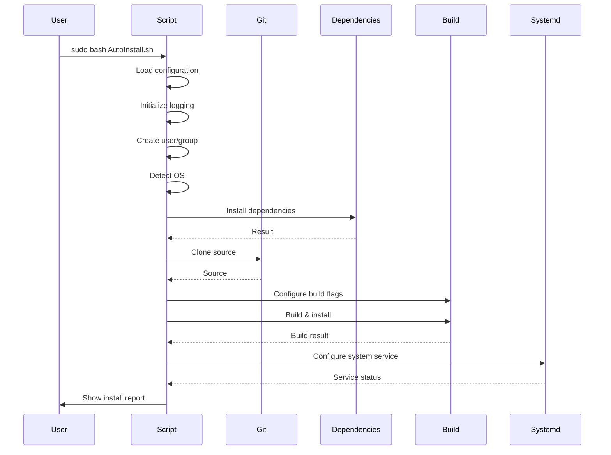
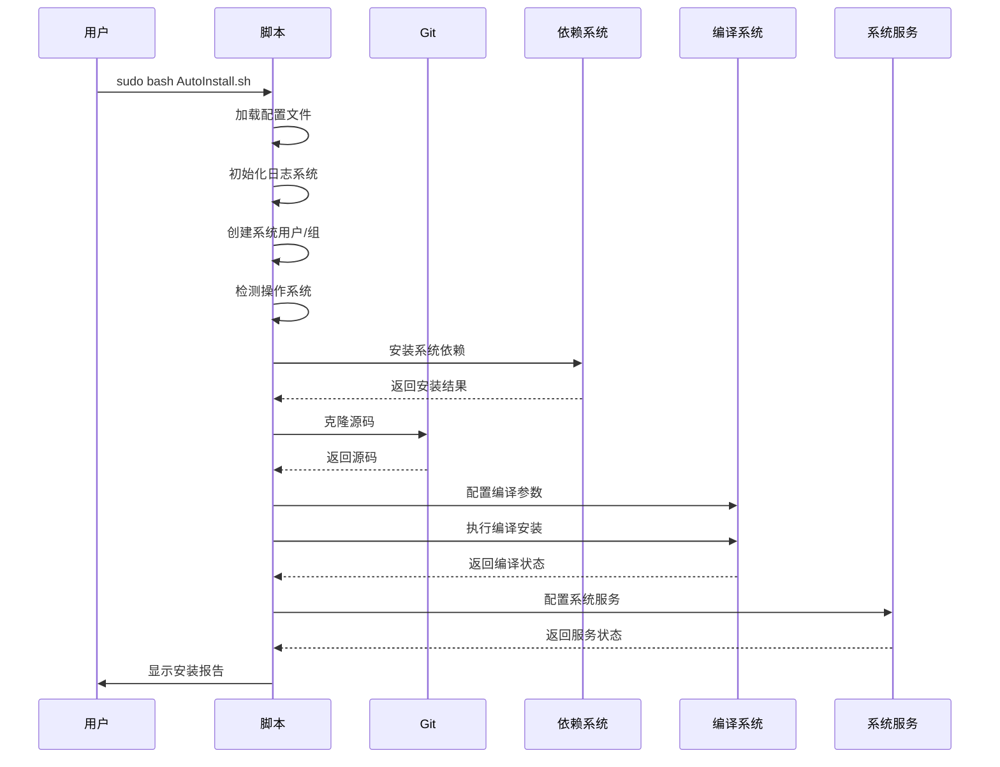

<p align="right">
  <a href="#english">English</a> | <a href="#中文">中文</a>
</p>

<a id="english"></a>
# IvorySQL-AutoInstall — User Guide

> Applies to **AutoInstall.sh** with config **ivorysql.conf**. Last updated: 2025-09-13 15:29:35

## 1. Project Introduction

IvorySQL-AutoInstall is a professional shell installer designed to simplify compiling and installing IvorySQL from source. With a simple configuration file, users can complete the entire process—from building from source to starting the service—without manually running complex commands.

### 1.1 Core Features

- **Environment detection & validation**: Detect OS family/version and verify compatibility
- **Smart dependency management**: Install build-time dependencies with multiple package managers
- **Source fetch & compilation**: Clone from a specified repository and accelerate builds with parallel make
- **Automated installation & configuration**: Set up install/data/log directories and ownership
- **Service integration**: Create a systemd unit and configure environment variables
- **Comprehensive logging**: Detailed logs for every step to aid troubleshooting
- **Error handling & rollback**: Robust detection and handling logic to fail fast with guidance

### 1.2 Supported Operating Systems

| OS Family | Distributions | Supported Versions |
|-----------|----------------|--------------------|
| RHEL Family | CentOS, RHEL, Rocky Linux, AlmaLinux, Oracle Linux | 8.x, 9.x, 10.x |
| Debian Family | Ubuntu, Debian | Ubuntu 18.04–24.04, Debian 10–12 |
| SUSE Family | openSUSE, SLES | openSUSE Leap 15+, SLES 12.5+ |
| Arch Linux | Arch Linux | Latest stable |

> **Note**: CentOS 7 is not supported. Use official YUM packages instead.

## 2. Architecture Overview

```mermaid
graph TD
    A[Start] --> B[Root Privilege Check]
    B --> C[Load Configuration]
    C --> D[Initialize Logging]
    D --> E[Create System User/Group]
    E --> F[Detect OS Environment]
    F --> G[Install Dependencies]
    G --> H[Compile & Install from Source]
    H --> I[Post-Install Configuration]
    I --> J[Verify Installation]
    J --> K[Success Report]

    style A fill:#4CAF50,stroke:#333
    style K fill:#4CAF50,stroke:#333

    B -->|Failure| ERR[Print Error and Exit]
    C -->|Config Error| ERR
    D -->|Logging Init Failed| ERR
    E -->|User Creation Failed| ERR
    F -->|Unsupported Environment| ERR
    G -->|Dependency Install Failed| ERR
    H -->|Build Error| ERR
    I -->|Config Error| ERR
    J -->|Service Start Failed| ERR

    subgraph Configuration Stage
        C1[Config Validation] --> C11[Path Format Check]
        C1 --> C12[Reserved Name Filter]
        C1 --> C13[Dangerous Character Scan]
        C1 --> C14[Version Priority]
        C --> C1
    end

    subgraph Environment Detection
        F1[OS Detection] --> F11[RHEL Family]
        F1 --> F12[Debian Family]
        F1 --> F13[SUSE Family]
        F1 --> F14[Arch Linux]
        F1 --> F15[Special Handling]
        F --> F1

        F2[Package Manager] --> F21[dnf/yum]
        F2 --> F22[apt-get]
        F2 --> F23[zypper]
        F2 --> F24[pacman]
        F --> F2
    end

    subgraph Dependency Management
        G1[Core Deps] --> G11[Toolchain]
        G1 --> G12[Core Libraries]
        G1 --> G13[Perl Environment]
        G --> G1

        G2[Optional Deps] --> G21[ICU Detection]
        G2 --> G22[XML Support Detection]
        G2 --> G23[TCL Detection]
        G2 --> G24[Perl Dev Headers]
        G --> G2

        G3[Special Handling] --> G31[Rocky Linux 10]
        G3 --> G32[Oracle Linux]
        G3 --> G33[Perl Module Install]
        G --> G3
    end

    subgraph Build Stage
        H1[Source Retrieval] --> H11[Git Clone]
        H1 --> H12[Retry Strategy]
        H --> H1

        H2[Version Control] --> H21[TAG First]
        H2 --> H22[BRANCH Switch]
        H2 --> H23[Record Commit ID]
        H --> H2

        H3[Env Validation] --> H31[Perl Module Check]
        H3 --> H32[Toolchain Check]
        H --> H3

        H4[Configure Options] --> H41[Base Flags]
        H4 --> H42[Feature Flags]
        H4 --> H43[Run ./configure]
        H --> H4

        H5[Build Process] --> H51[Parallel Make]
        H5 --> H52[Error Handling]
        H --> H5

        H6[Install Process] --> H61[Binary Install]
        H6 --> H62[Ownership Set]
        H --> H6
    end

    subgraph Post-Install
        I1[Data Directory] --> I11[Create Folder]
        I1 --> I12[Set Permissions]
        I1 --> I13[Clear Non-Empty Dir]
        I --> I1

        I2[Environment] --> I21[bash_profile Setup]
        I2 --> I22[Activate Variables]
        I --> I2

        I3[DB Initialization] --> I31[initdb]
        I3 --> I32[Feature Switches]
        I3 --> I33[Log Recording]
        I --> I3

        I4[Service Config] --> I41[Unit File]
        I4 --> I42[Unit Params]
        I4 --> I43[Enable Service]
        I4 --> I44[OOM Protection]
        I --> I4
    end

    subgraph Verification
        J1[Service Start] --> J11[systemctl start]
        J1 --> J12[Error Handling]
        J --> J1

        J2[Status Monitor] --> J21[Active Check]
        J2 --> J22[Timeout Handling]
        J --> J2

        J3[Function Check] --> J31[Extension Check]
        J3 --> J32[Connectivity Test]
        J --> J3

        J4[Report] --> J41[Install Summary]
        J4 --> J42[Admin Commands]
        J4 --> J43[Troubleshooting]
        J --> J4
    end

    %% Additional Optimizations
    D -->|Early Logging| G[Install Dependencies]
    G2 -->|Realtime Feedback| H4[Configure Options]
    I3 -->|XML Support State| I32[Feature Switches]
    J -->|Service Status| J2[Status Monitor]
    K -->|Include| J4[Report]

    style ERR fill:#FF5722,stroke:#333
```



## 3. Project Details

### 3.1 Configuration File

> **Location**: `ivorysql.conf` in the project root

| Key | Required | Default | Description |
|-----|----------|---------|-------------|
| INSTALL_DIR | Yes | — | Install prefix (absolute path) |
| DATA_DIR | Yes | — | Data directory (absolute path) |
| SERVICE_USER | Yes | — | Service user (not a reserved name) |
| SERVICE_GROUP | Yes | — | Service group (not a reserved name) |
| REPO_URL | Yes | — | IvorySQL source repository URL |
| LOG_DIR | Yes | — | Log directory (absolute path) |
| TAG | Optional | — | Release tag (preferred) |
| BRANCH | Optional | — | Source branch |

**Notes**
- All paths must be absolute and without spaces
- Either TAG or BRANCH must be set (TAG takes precedence if both are set)
- Service user/group must not be system-reserved names (e.g., root, bin, daemon)
- The script enforces `chmod 600` on the config file

**Example**
```ini
INSTALL_DIR=/usr/ivorysql
DATA_DIR=/var/lib/ivorysql/data
SERVICE_USER=ivorysql
SERVICE_GROUP=ivorysql
REPO_URL=https://github.com/IvorySQL/IvorySQL.git
LOG_DIR=/var/log/ivorysql
TAG=IvorySQL_4.5.3
```

### 3.2 Dependency Management

#### Core Dependencies (mandatory)
- Toolchain: GCC, Make, Flex, Bison
- Core libs: readline, zlib, openssl
- Perl: perl-core, perl-devel, perl-IPC-Run

#### Optional Dependencies (auto-detected; features disabled if missing)

| Library | Check Path | Auto Handling |
|--------|------------|---------------|
| ICU | `/usr/include/icu.h` or `/usr/include/unicode/utypes.h` | Add `--without-icu` if not found |
| libxml2 | `/usr/include/libxml2/libxml/parser.h` | Add `--without-libxml` if not found |
| TCL | `/usr/include/tcl.h` | Add `--without-tcl` if not found |
| Perl | `/usr/bin/perl` and headers | Add `--without-perl` if dev env missing |

#### OS-Specific Commands

| OS | Commands |
|----|----------|
| RHEL Family | `dnf group install "Development Tools"`<br>`dnf install readline-devel zlib-devel openssl-devel` |
| Debian Family | `apt-get install build-essential libreadline-dev zlib1g-dev libssl-dev` |
| SUSE Family | `zypper install gcc make flex bison readline-devel zlib-devel libopenssl-devel` |
| Arch Linux | `pacman -S base-devel readline zlib openssl` |

#### Features
- **OS auto-detection**
- **Mandatory toolchain installation**
- **Smart feature gating** by scanning headers and adjusting `./configure` flags
- **Toolchain verification**, e.g.:
  ```bash
  for cmd in gcc make flex bison; do
    command -v $cmd >/dev/null || echo "Warning: $cmd not installed"
  done
  ```

### 3.3 Build Process

#### Versioning
- Prefer TAG if set
- Fallback to BRANCH if TAG is not set
- Record short commit ID

#### Configure
```bash
./configure --prefix=$INSTALL_DIR             --with-openssl             --with-readline             --without-icu \        # when ICU not found
            --without-libxml \     # when libxml2 not found
            --without-tcl \        # when TCL not found
            --without-perl         # when Perl dev not found
```

#### Parallel Build
- Use all CPUs: `make -j$(nproc)`

#### Post-Install
- Ownership: `chown -R $SERVICE_USER:$SERVICE_GROUP $INSTALL_DIR`
- Validate binaries

### 3.4 Service Management

#### Systemd Unit
Path: `/etc/systemd/system/ivorysql.service`

```ini
[Unit]
Description=IvorySQL Database Server
Documentation=https://www.ivorysql.org
Requires=network.target local-fs.target
After=network.target local-fs.target

[Service]
Type=forking
User=ivorysql
Group=ivorysql
Environment=PGDATA=/var/lib/ivorysql/data
Environment=LD_LIBRARY_PATH=/usr/ivorysql/lib:/usr/ivorysql/lib/postgresql
OOMScoreAdjust=-1000
ExecStart=/usr/ivorysql/bin/pg_ctl start -D ${PGDATA} -s -w -t 60
ExecStop=/usr/ivorysql/bin/pg_ctl stop -D ${PGDATA} -s -m fast
ExecReload=/usr/ivorysql/bin/pg_ctl reload -D ${PGDATA}
TimeoutSec=60
Restart=on-failure
RestartSec=5s

[Install]
WantedBy=multi-user.target
```

**Notes**
- `OOMScoreAdjust=-1000`: largely reduces the chance of OOM-killer terminating the DB
- `TimeoutSec=60`: provide reasonable timeout rather than 0
- `Restart=on-failure`: auto-restart on failure
- `Type=forking`: proper management of background process
- `LD_LIBRARY_PATH`: ensure libraries are loaded correctly

#### Environment Setup
Path: `/home/ivorysql/.bash_profile`
```bash
# --- IvorySQL Environment Configuration ---
PATH="/usr/ivorysql/bin:$PATH"
export PATH
PGDATA="/var/lib/ivorysql/data"
export PGDATA
# --- End of Configuration ---
```

**Effect**
- Run tools like `psql` directly
- Data directory recognized via `PGDATA`
- Auto-configured environment for the service user
- Correct library loading

### 3.5 Logging System
#### Layout
```
/var/log/ivorysql/
├── install_YYYYmmdd_HHMMSS.log  # install logs
├── error_YYYYmmdd_HHMMSS.log    # error logs
├── initdb_YYYYmmdd_HHMMSS.log   # initdb logs
└── postgresql.log               # DB runtime log
```

#### Features
- Rotation via PostgreSQL built-in logging
- Ownership: `chown -R ivorysql:ivorysql /var/log/ivorysql`
- Adjustable log levels (DB config)
- Timestamped, step-marked install logs

#### Example
```
[14:25:33] Config Loading
  → Check config file exists...
  ✓ Found configuration
  → Load configuration...
  ✓ Loaded successfully
```
### 3.6 Non-Interactive Mode (`NON_INTERACTIVE`)
- The script reads `NON_INTERACTIVE` at startup: `NON_INTERACTIVE="${NON_INTERACTIVE:-0}"`.
- When **`NON_INTERACTIVE=1`**, the installer will **auto-accept** the following confirmations and continue:
  1) Using a **non-official** repository (`REPO_URL` not under `github.com/IvorySQL/IvorySQL`)
  2) Confirmations for **overlong** `TAG` / `BRANCH` identifiers (**length > 100**)
- When unset or `0`, the installer will **prompt and wait** for your confirmation in the above scenarios.
- This mode **does not skip errors** nor alter validation logic; it **only bypasses interactive prompts**.
- **Example (CI/unattended):**
  ```bash
  NON_INTERACTIVE=1 sudo bash AutoInstall.sh -c ivorysql.conf
  ```


## 4. User Guide


### 4.1 Preparation
1. **Switch to root**:
   ```bash
   su -
   # or
   sudo -i
   ```
2. **Clone the project** (contains the config):
   ```bash
   git clone https://github.com/yangchunwanwusheng/IvorySQL-AutoInstaller.git
   ```
3. **Enter the project directory and add execution permissions**:
   ```bash
   cd IvorySQL-AutoInstaller
   chmod +x AutoInstall.sh
   ```

### 4.2 (Optional) Edit Configuration
1. **Open config**:
   ```bash
   nano ivorysql.conf
   ```
2. **Reference (LOG_DIR is required; absolute paths only):**
   ```ini
   INSTALL_DIR=/usr/ivorysql
   DATA_DIR=/var/lib/ivorysql/data
   SERVICE_USER=ivorysql
   SERVICE_GROUP=ivorysql
   REPO_URL=https://github.com/IvorySQL/IvorySQL.git
   LOG_DIR=/var/log/ivorysql           # required (no default)
   TAG=IvorySQL_4.5.3                  # optional; prefer TAG over BRANCH
   # BRANCH=
   ```

### 4.3 Interactive Installation (default)
> Suitable for manual runs; prompts on **non-official repo** or **overlong TAG/BRANCH**.
```bash
sudo bash AutoInstall.sh -c ivorysql.conf
```

### 4.4 Non-Interactive Installation (CI/unattended)
Set `NON_INTERACTIVE=1` to **auto-accept** the prompts mentioned above. This only skips confirmations; it **does not** bypass validations or errors.

**Example:**
```bash
NON_INTERACTIVE=1 sudo bash AutoInstall.sh -c ivorysql.conf
```

### 4.5 Verify Installation
An example success report:
```
================ INSTALL SUCCESS ================
Install dir: /usr/ivorysql
Data dir: /var/lib/ivorysql/data
Log dir: /var/log/ivorysql
Service: active
Version: ivorysql (IvorySQL) 4.5.3

Admin cmds:
  systemctl [start|stop|status] ivorysql
  journalctl -u ivorysql -f
  sudo -u ivorysql '/usr/ivorysql/bin/psql'

Time: 2025-08-26 14:30:45 CST
Elapsed: 215 s
Host: rocky 10.2
```

### 4.6 Service Commands
| Action | Command | Notes |
|-------|---------|-------|
| Start | `systemctl start ivorysql` | Start DB service |
| Stop | `systemctl stop ivorysql` | Stop DB service |
| Status | `systemctl status ivorysql` | Inspect service state |
| Logs | `journalctl -u ivorysql -f` | Follow service logs |
| Reload | `systemctl reload ivorysql` | Reload configs |
| Connect | `sudo -u ivorysql /usr/ivorysql/bin/psql` | Connect to DB |
| Version | `/usr/ivorysql/bin/postgres --version` | Show version |
| Base Backup | `sudo -u ivorysql /usr/ivorysql/bin/pg_basebackup` | Create base backup |

## 5. Troubleshooting

### 5.1 Common Issues

| Symptom | Likely Cause | Fix |
|--------|--------------|-----|
| Config missing | Wrong path | Check `ivorysql.conf` exists |
| Dependency install failed | Network/mirror issue | Check network; switch mirrors |
| Build error | Unsupported env | Check OS version; read error log |
| initdb failed | Data dir ownership | `chown ivorysql:ivorysql /var/lib/ivorysql/data` |
| Service failed | Port conflict or config error | `ss -tulnp | grep 5432` |

### 5.2 Diagnostic Commands
```bash
systemctl status ivorysql -l --no-pager
journalctl -u ivorysql --since "1 hour ago" --no-pager
sudo -u ivorysql /usr/ivorysql/bin/postgres -D /var/lib/ivorysql/data -c logging_collector=on
ls -l IvorySQL-AutoInstaller/ivorysql.conf
cat IvorySQL-AutoInstaller/ivorysql.conf
```

### 5.3 Log Locations
- Install logs: `/var/log/ivorysql/install_<ts>.log`
- Error logs: `/var/log/ivorysql/error_<ts>.log`
- initdb logs: `/var/log/ivorysql/initdb_<ts>.log`
- DB logs: `/var/log/ivorysql/postgresql.log`

### 5.4 Special Handling

#### Rocky Linux 10 / Oracle Linux 10
- Auto-enable CRB/Devel repositories when needed
- Fallback strategies to install `libxml2-devel` (including `--allowerasing`)
- Check status:
```bash
grep "XML_SUPPORT" /var/log/ivorysql/install_*.log
```

#### Perl Environment
- Auto-check required modules (`FindBin`, `IPC::Run`)
- Try package manager or CPAN
```bash
dnf install -y perl-IPC-Run
PERL_MM_USE_DEFAULT=1 cpan -i IPC::Run FindBin
perl -MFindBin -e 1
perl -MIPC::Run -e 1
```

## 6. Appendix: Full Workflow



---

<a id="中文"></a>
# IvorySQL-AutoInstall 自动化安装工具使用文档

## 1. 项目介绍

IvorySQL-AutoInstall 是一个专业的自动化安装脚本，旨在简化 IvorySQL 数据库的编译安装过程。通过简单的配置文件设置，用户可以一键完成从源码编译到服务启动的全过程，无需手动执行复杂的编译命令和配置步骤。

### 1.1 核心功能

- **环境检测与验证**：自动检测操作系统类型和版本，验证系统兼容性
- **智能依赖管理**：自动安装编译所需依赖包，支持多平台包管理器
- **源码获取与编译**：从指定仓库获取源代码，并行编译优化构建速度
- **自动化安装配置**：自动设置安装目录、数据目录和日志目录权限
- **服务集成**：自动创建 systemd 服务并配置环境变量
- **全面日志记录**：详细记录安装过程，便于故障排查
- **错误处理与回滚**：完善的错误检测和处理机制

### 1.2 支持的操作系统

| 操作系统系列 | 具体发行版 | 支持版本 |
|-------------|-----------|----------|
| RHEL 系列 | CentOS, RHEL, Rocky Linux, AlmaLinux, Oracle Linux | 8.x, 9.x, 10.x |
| Debian 系列 | Ubuntu, Debian | Ubuntu 18.04-24.04, Debian 10-12 |
| SUSE 系列 | openSUSE, SLES | openSUSE Leap 15+, SLES 12.5+ |
| Arch Linux | Arch Linux | 最新稳定版 |

> **注意**：CentOS 7 推荐使用官方 YUM 源安装，本项目不支持 CentOS 7

## 2. 项目架构设计

```mermaid
graph TD
    A[开始] --> B[Root权限检查]
    B --> C[加载配置文件]
    C --> D[初始化日志系统]
    D --> E[创建系统用户/组]
    E --> F[检测操作系统环境]
    F --> G[安装系统依赖]
    G --> H[源码编译安装]
    H --> I[后期配置]
    I --> J[验证安装]
    J --> K[输出成功报告]

    style A fill:#4CAF50,stroke:#333
    style K fill:#4CAF50,stroke:#333

    B -->|失败| ERR[输出错误并退出]
    C -->|配置错误| ERR
    D -->|日志初始化失败| ERR
    E -->|用户创建失败| ERR
    F -->|环境不支持| ERR
    G -->|依赖安装失败| ERR
    H -->|编译错误| ERR
    I -->|配置错误| ERR
    J -->|启动失败| ERR

    subgraph 配置阶段
        C1[配置文件验证] --> C11[路径格式检查]
        C1 --> C12[保留名称过滤]
        C1 --> C13[危险字符检测]
        C1 --> C14[版本优先级处理]
        C --> C1
    end

    subgraph 环境检测
        F1[操作系统识别] --> F11[RHEL系列]
        F1 --> F12[Debian系列]
        F1 --> F13[SUSE系列]
        F1 --> F14[Arch Linux]
        F1 --> F15[特殊系统处理]
        F --> F1

        F2[包管理器确定] --> F21[dnf/yum]
        F2 --> F22[apt-get]
        F2 --> F23[zypper]
        F2 --> F24[pacman]
        F --> F2
    end

    subgraph 依赖管理
        G1[核心依赖] --> G11[编译工具链]
        G1 --> G12[核心库]
        G1 --> G13[Perl环境]
        G --> G1

        G2[可选依赖] --> G21[ICU检测]
        G2 --> G22[XML支持检测]
        G2 --> G23[TCL检测]
        G2 --> G24[Perl开发环境]
        G --> G2

        G3[特殊系统处理] --> G31[Rocky Linux 10]
        G3 --> G32[Oracle Linux]
        G3 --> G33[Perl模块安装]
        G --> G3
    end

    subgraph 编译阶段
        H1[源码获取] --> H11[Git克隆]
        H1 --> H12[重试机制]
        H --> H1

        H2[版本控制] --> H21[TAG优先]
        H2 --> H22[分支切换]
        H2 --> H23[Commit ID记录]
        H --> H2

        H3[环境验证] --> H31[Perl模块验证]
        H3 --> H32[工具链验证]
        H --> H3

        H4[编译配置] --> H41[基础参数]
        H4 --> H42[功能支持参数]
        H4 --> H43[配置执行]
        H --> H4

        H5[编译过程] --> H51[并行编译]
        H5 --> H52[错误处理]
        H --> H5

        H6[安装过程] --> H61[二进制安装]
        H6 --> H62[权限设置]
        H --> H6
    end

    subgraph 后期配置
        I1[数据目录] --> I11[目录创建]
        I1 --> I12[权限设置]
        I1 --> I13[清除非空目录]
        I --> I1

        I2[环境变量] --> I21[bash_profile配置]
        I2 --> I22[环境变量生效]
        I --> I2

        I3[数据库初始化] --> I31[initdb命令]
        I3 --> I32[功能支持处理]
        I3 --> I33[日志记录]
        I --> I3

        I4[服务配置] --> I41[服务文件创建]
        I4 --> I42[服务参数配置]
        I4 --> I43[服务启用]
        I4 --> I44[OOM保护配置]
        I --> I4
    end

    subgraph 验证阶段
        J1[服务启动] --> J11[systemctl启动]
        J1 --> J12[错误处理]
        J --> J1

        J2[状态监控] --> J21[活动状态检查]
        J2 --> J22[超时处理]
        J --> J2

        J3[功能验证] --> J31[扩展功能验证]
        J3 --> J32[连接测试]
        J --> J3

        J4[报告生成] --> J41[安装摘要]
        J4 --> J42[管理命令]
        J4 --> J43[问题排查指南]
        J --> J4
    end

    %% 新增的优化点
    D -->|提前日志初始化| G[依赖安装]
    G2 -->|实时反馈| H4[编译配置]
    I3 -->|XML支持状态| I32[功能支持处理]
    J -->|服务状态| J2[状态监控]
    K -->|包含| J4[报告生成]

    style ERR fill:#FF5722,stroke:#333
```



## 3. 项目细节

### 3.1 配置文件详解

> **重要变更**：配置文件位置为项目目录下的 `ivorysql.conf`

| 配置项 | 是否必需 | 默认值 | 说明 |
|--------|----------|--------|------|
| INSTALL_DIR | 是 | 无 | IvorySQL 安装目录（必须是绝对路径） |
| DATA_DIR | 是 | 无 | 数据库数据目录（必须是绝对路径） |
| SERVICE_USER | 是 | 无 | 服务运行用户（不能使用系统保留名称） |
| SERVICE_GROUP | 是 | 无 | 服务运行组（不能使用系统保留名称） |
| REPO_URL | 是 | 无 | IvorySQL 源码仓库 URL |
| LOG_DIR | 是 | 无 | 日志目录（必须是绝对路径） |
| TAG | 可选 | 无 | 指定安装的版本标签（优先使用） |
| BRANCH | 可选 | 无 | 指定安装的源码分支 |

**配置注意事项**：
- 所有路径配置必须是绝对路径，不能包含空格
- 必须设置 TAG 或 BRANCH 中的一个，同时设置时优先使用 TAG
- 用户/组名称不能使用系统保留名称（root, bin, daemon 等）

**配置示例**：
```ini
# IvorySQL 自动化安装配置
INSTALL_DIR=/usr/ivorysql
DATA_DIR=/var/lib/ivorysql/data
SERVICE_USER=ivorysql
SERVICE_GROUP=ivorysql
REPO_URL=https://github.com/IvorySQL/IvorySQL.git
LOG_DIR=/var/log/ivorysql
TAG=IvorySQL_4.5.3
```

### 3.2 依赖管理系统

#### 核心依赖（必备组件，自动强制安装）
- 编译工具链: GCC, Make, Flex, Bison
- 核心库: readline, zlib, openssl
- Perl 环境: perl-core, perl-devel, perl-IPC-Run

#### 可选依赖支持（智能检测机制，未找到时自动禁用对应功能）

| 依赖库 | 检测路径 | 自动处理 |
|--------|----------|----------|
| ICU | `/usr/include/icu.h` 或 `/usr/include/unicode/utypes.h` | 检测不到时添加 `--without-icu` 编译参数 |
| libxml2 | `/usr/include/libxml2/libxml/parser.h` | 检测不到时添加 `--without-libxml` |
| TCL | `/usr/include/tcl.h` | 检测不到时添加 `--without-tcl` |
| Perl | `/usr/bin/perl` 和 Perl 头文件 | 检测不到时添加 `--without-perl` |

#### 操作系统特定依赖安装命令

| 操作系统 | 安装命令 |
|----------|----------|
| RHEL 系列 (CentOS/RHEL/Rocky) | `dnf group install "Development Tools"` <br> `dnf install readline-devel zlib-devel openssl-devel` |
| Debian 系列 (Ubuntu/Debian) | `apt-get install build-essential libreadline-dev zlib1g-dev libssl-dev` |
| SUSE 系列 (openSUSE/SLES) | `zypper install gcc make flex bison readline-devel zlib-devel libopenssl-devel` |
| Arch Linux | `pacman -S base-devel readline zlib openssl` |

#### 实现特性
- **操作系统自动识别**：精确检测RHEL/Debian/SUSE等主流发行版
- **核心依赖强制安装**：确保编译工具链和核心库完备
- **智能依赖检测**：
  - 自动扫描标准头文件路径
  - 缺失时动态调整编译参数
  - 实时反馈功能禁用状态
- **完整工具链验证**：
  ```bash
  for cmd in gcc make flex bison; do
    command -v $cmd >/dev/null || echo "警告: $cmd 未安装"
  done
  ```

### 3.3 编译流程详解

#### 版本控制
- 优先使用 TAG 指定的版本
- 未指定 TAG 时使用 BRANCH 指定的分支
- 记录安装的 Commit ID（短哈希值）

#### 编译配置
```bash
./configure --prefix=$INSTALL_DIR \
            --with-openssl \
            --with-readline \
            --without-icu \        # 当检测不到 ICU 时
            --without-libxml \     # 当检测不到 libxml2 时
            --without-tcl \        # 当检测不到 TCL 时
            --without-perl         # 当检测不到 Perl 开发环境时
```

#### 并行编译
- 使用所有可用 CPU 核心：`make -j$(nproc)`
- 优化大型项目的编译速度

#### 安装后处理
- 设置安装目录权限：`chown -R $SERVICE_USER:$SERVICE_GROUP $INSTALL_DIR`
- 验证二进制文件完整性

### 3.4 服务管理系统

#### Systemd 服务文件
路径：`/etc/systemd/system/ivorysql.service`

```ini
[Unit]
Description=IvorySQL Database Server
Documentation=https://www.ivorysql.org
Requires=network.target local-fs.target
After=network.target local-fs.target

[Service]
Type=forking
User=ivorysql
Group=ivorysql
Environment=PGDATA=/var/lib/ivorysql/data
Environment=LD_LIBRARY_PATH=/usr/ivorysql/lib:/usr/ivorysql/lib/postgresql
OOMScoreAdjust=-1000
ExecStart=/usr/ivorysql/bin/pg_ctl start -D ${PGDATA} -s -w -t 60
ExecStop=/usr/ivorysql/bin/pg_ctl stop -D ${PGDATA} -s -m fast
ExecReload=/usr/ivorysql/bin/pg_ctl reload -D ${PGDATA}
TimeoutSec=60
Restart=on-failure
RestartSec=5s

[Install]
WantedBy=multi-user.target
```

**配置说明**：
- `OOMScoreAdjust=-1000`：显著降低 OOM Killer 终止数据库进程的可能性
- `TimeoutSec=60`：设置 60 秒超时
- `Restart=on-failure`：服务异常退出时自动重启
- `Type=forking`：正确管理后台进程的生命周期
- `LD_LIBRARY_PATH`：确保正确加载 IvorySQL 库文件

#### 环境变量配置
路径：`/home/ivorysql/.bash_profile`

```bash
# --- IvorySQL Environment Configuration ---
PATH="/usr/ivorysql/bin:$PATH"
export PATH
PGDATA="/var/lib/ivorysql/data"
export PGDATA
# --- End of Configuration ---
```

**效果**：
- 可直接在命令行执行 `psql` 等命令
- 数据库工具自动识别数据目录位置
- 服务账户登录时自动配置环境
- 确保正确加载 IvorySQL 库文件

### 3.5 日志系统

#### 日志文件结构
```
/var/log/ivorysql/
├── install_20250101_120000.log  # 安装过程日志
├── error_20250101_120000.log    # 安装错误日志
├── initdb_20250101_120000.log   # 数据库初始化日志
└── postgresql.log               # 数据库运行日志（服务启动后生成）
```

#### 日志管理特性
- **自动轮转**：通过 PostgreSQL 内置日志管理实现
- **权限控制**：`chown -R ivorysql:ivorysql /var/log/ivorysql`
- **日志级别**：可在数据库配置中调整
- **安装日志**：包含完整的时间戳和步骤标记

#### 日志格式示例
```
[14:25:33] 配置加载阶段
  → 检查配置文件是否存在...
  ✓ 发现配置文件
  → 加载配置文件...
  ✓ 配置文件加载成功
```

### 3.6 非交互模式（`NON_INTERACTIVE`）
- 脚本在启动时读取环境变量：`NON_INTERACTIVE="${NON_INTERACTIVE:-0}"`。
- 当 **`NON_INTERACTIVE=1`** 时，安装器会**自动接受**以下确认并继续执行：
  1) 使用**非官方源**（当 `REPO_URL` 不在 `github.com/IvorySQL/IvorySQL` 域名下）
  2) `TAG` / `BRANCH` **长度超过 100** 的确认提示
- 未设置或设为 `0` 时，脚本会在上述场景**提示并等待用户确认**。
- 该模式**不会跳过错误**、**不会降低校验严格度**，仅用于**跳过交互式确认**。
- **示例（CI/无人值守）**：
  ```bash
  NON_INTERACTIVE=1 sudo bash AutoInstall.sh -c ivorysql.conf
  ```

## 4. 使用指南


### 4.1 准备工作
1. **使用 root 权限**：
   ```bash
   su -
   # 或
   sudo -i
   ```

2. **克隆项目**（包含配置文件）：
   ```bash
   git clone https://github.com/yangchunwanwusheng/IvorySQL-AutoInstaller.git
   ```

3. **进入项目目录并添加执行权限**：
   ```bash
   cd IvorySQL-AutoInstaller
   chmod +x AutoInstall.sh
   ```

### 4.2 配置修改（可选）
1. **编辑配置文件**：
   ```bash
   nano ivorysql.conf
   ```
2. **配置参考（`LOG_DIR` 为必填；路径需为绝对路径）**：
   ```ini
   INSTALL_DIR=/usr/ivorysql
   DATA_DIR=/var/lib/ivorysql/data
   SERVICE_USER=ivorysql
   SERVICE_GROUP=ivorysql
   REPO_URL=https://github.com/IvorySQL/IvorySQL.git
   LOG_DIR=/var/log/ivorysql           # 必填（无默认值）
   TAG=IvorySQL_4.5.3                  # 可选；与 BRANCH 二选一（TAG 优先）
   # BRANCH=
   ```

### 4.3 交互式安装（默认）
> 适合手动部署；遇到**非官方源**或**超长 TAG/BRANCH** 时会提示确认。
```bash
sudo bash AutoInstall.sh -c ivorysql.conf
```

### 4.4 非交互式安装（CI/无人值守）
将环境变量 `NON_INTERACTIVE=1`，脚本会**自动接受**上面提到的确认提示。仅跳过确认，**不**会跳过校验或错误。

**示例：**
```bash
NON_INTERACTIVE=1 sudo bash AutoInstall.sh -c ivorysql.conf
```

### 4.5 安装验证

成功安装后，将显示以下信息：
```
================ 安装成功 ================
安装目录: /usr/ivorysql
数据目录: /var/lib/ivorysql/data
日志目录: /var/log/ivorysql
服务状态: active
数据库版本: ivorysql (IvorySQL) 4.5.3

管理命令: 
  systemctl [start|stop|status] ivorysql
  journalctl -u ivorysql -f
  sudo -u ivorysql '/usr/ivorysql/bin/psql'

安装时间: 2025年 08月 26日 星期二 14:30:45 CST
安装耗时: 215 秒

安装标识号: 20250826_143045
操作系统: rocky 10.2
```

### 4.6 服务管理命令

| 功能 | 命令 | 说明 |
|------|------|------|
| 启动服务 | `systemctl start ivorysql` | 启动数据库服务 |
| 停止服务 | `systemctl stop ivorysql` | 停止数据库服务 |
| 服务状态 | `systemctl status ivorysql` | 查看服务运行状态 |
| 服务日志 | `journalctl -u ivorysql -f` | 实时查看服务日志 |
| 重载配置 | `systemctl reload ivorysql` | 重载服务配置 |
| 数据库连接 | `sudo -u ivorysql /usr/ivorysql/bin/psql` | 连接到数据库 |
| 查询版本 | `/usr/ivorysql/bin/postgres --version` | 查看数据库版本 |
| 初始化备份 | `sudo -u ivorysql /usr/ivorysql/bin/pg_basebackup` | 创建基础备份 |

## 5. 故障排查

### 5.1 常见错误处理

| 错误现象 | 可能原因 | 解决方案 |
|----------|----------|----------|
| 配置文件不存在 | 配置文件位置错误 | 检查项目目录下的 `ivorysql.conf` 是否存在 |
| 依赖安装失败 | 网络问题或软件源不可用 | 检查网络连接，尝试更换软件源 |
| 编译错误 | 系统环境不满足要求 | 检查系统版本是否符合要求，查看错误日志 |
| 数据库初始化失败 | 数据目录权限问题 | 检查数据目录所有权：`chown ivorysql:ivorysql /var/lib/ivorysql/data` |
| 服务启动失败 | 端口冲突或配置错误 | 检查端口占用：`ss -tulnp | grep 5432` |

### 5.2 诊断命令

1. **检查服务状态**：
   ```bash
   systemctl status ivorysql -l --no-pager
   ```

2. **查看完整日志**：
   ```bash
   journalctl -u ivorysql --since "1 hour ago" --no-pager
   ```

3. **手动启动调试**：
   ```bash
   sudo -u ivorysql /usr/ivorysql/bin/postgres -D /var/lib/ivorysql/data -c logging_collector=on
   ```

4. **检查配置文件**：
   ```bash
   ls -l IvorySQL-AutoInstaller/ivorysql.conf
   cat IvorySQL-AutoInstaller/ivorysql.conf
   ```

### 5.3 日志文件位置

- **安装日志**：`/var/log/ivorysql/install_<时间戳>.log`
- **错误日志**：`/var/log/ivorysql/error_<时间戳>.log`
- **初始化日志**：`/var/log/ivorysql/initdb_<时间戳>.log`
- **数据库日志**：`/var/log/ivorysql/postgresql.log`

### 5.4 特殊系统处理

#### Rocky Linux 10 / Oracle Linux 10 特殊处理
对于 EL10 系列系统，脚本会自动启用 CRB/Devel 仓库以确保能安装必要的开发包：

1. **自动启用仓库**：
   - 脚本会自动检测并启用 CRB 或 Devel 仓库
   - 无需手动操作

2. **XML支持增强**：
   - 如果自动启用仓库失败，会尝试多种方式安装 libxml2-devel
   - 包括使用 `--allowerasing` 参数强制安装

3. **日志中查看状态**：
   ```bash
   grep "XML_SUPPORT" /var/log/ivorysql/install_*.log
   ```

#### Perl 环境问题处理
如果系统缺少必要的 Perl 模块，脚本会尝试自动安装：

1. **自动检查模块**：
   - 脚本会自动检测缺失的 Perl 模块（FindBin、IPC::Run）
   - 尝试通过系统包管理器或 CPAN 安装

2. **手动安装（如果需要）**：
   ```bash
   # 尝试使用系统包管理器
   dnf install -y perl-IPC-Run
   # 或使用 CPAN
   cpan -i IPC::Run FindBin
   ```

3. **验证安装**：
   ```bash
   perl -MFindBin -e 1
   perl -MIPC::Run -e 1
   ```


## 6. 附录：完整工作流




